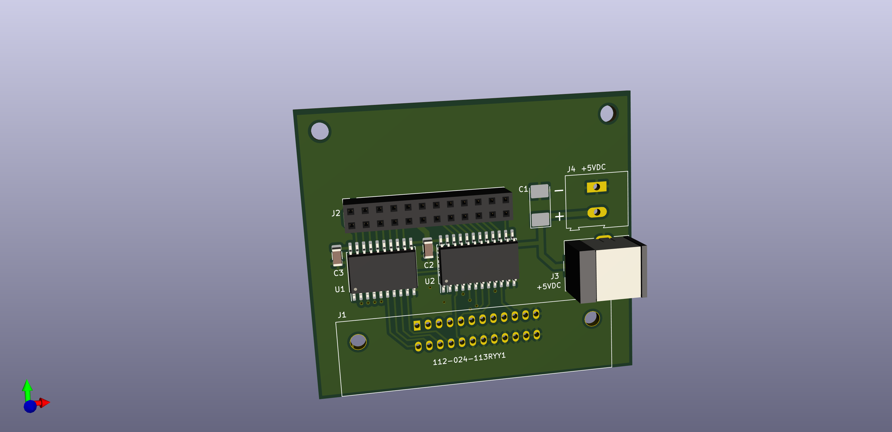
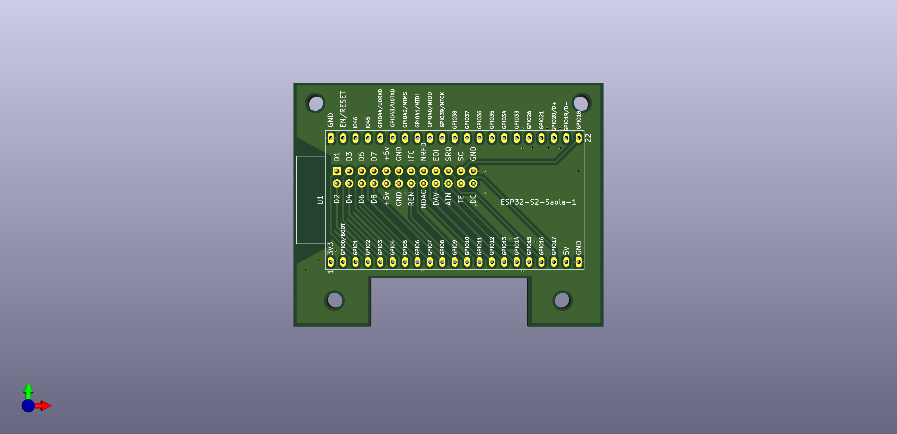
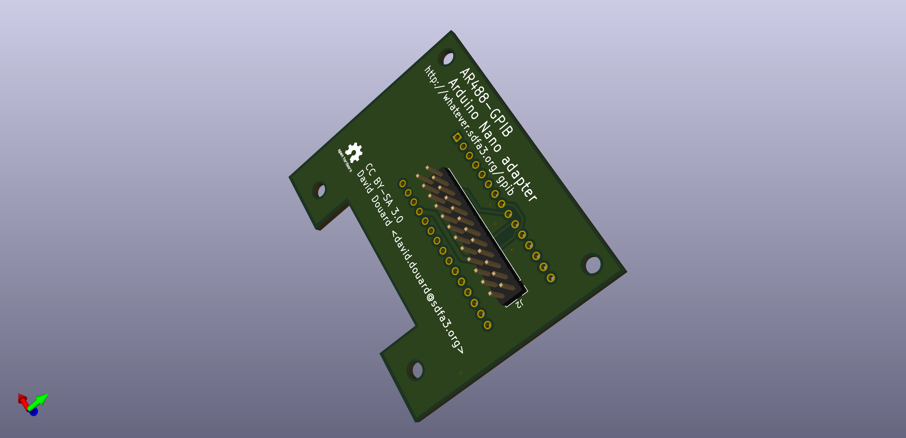
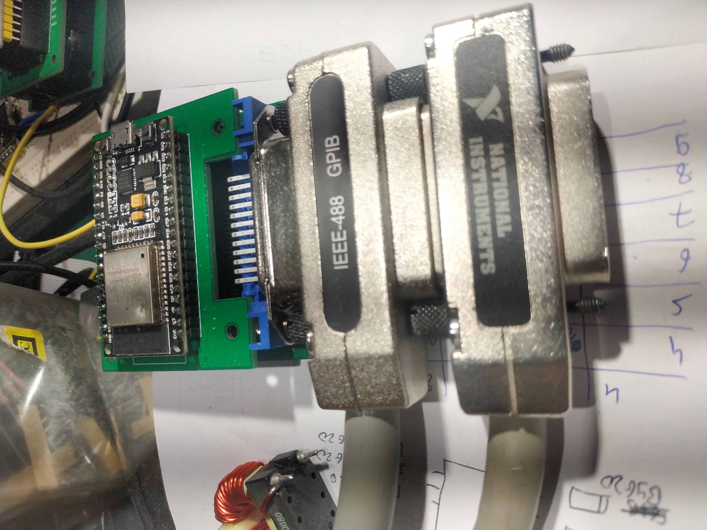
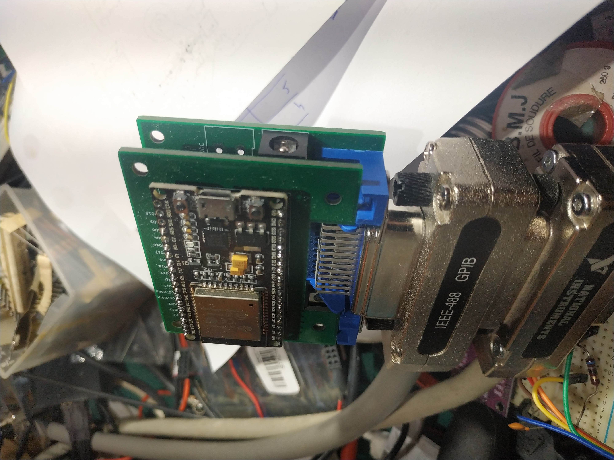
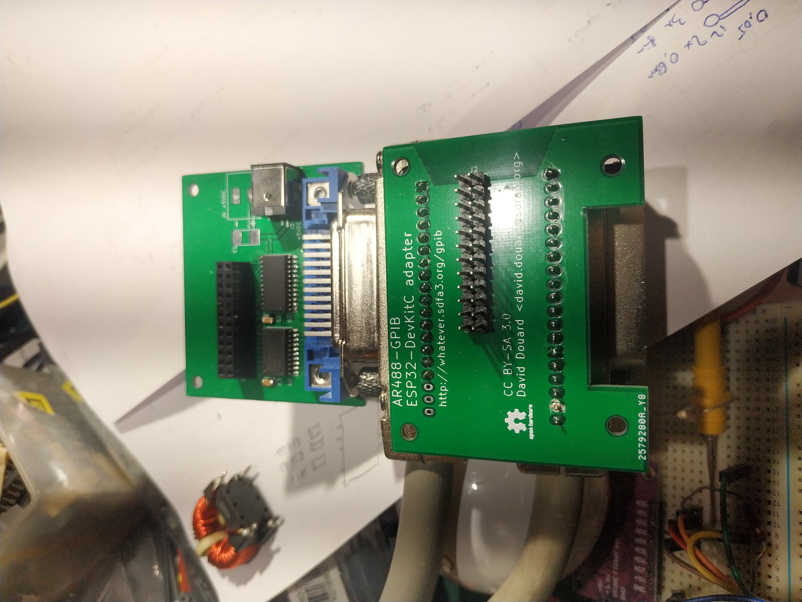

# ESP32 based GPIB interface - Kicad design files

This is a simple GPIB interface design using an ESP32 board as main controller. It can
(optionally but highly recommanded) use a couple of driver ICs (SN75160 and SN75161/162).

The design consist in 2 boards coupled together: one with the IEEE488 connector and
driver ICs, and one with the Arduino or ESP32 board.

Doing so, the common GPIB board can be used with several Arduino/ESP32 boards.

3D view of the common IEEE488 board:

3D view of the interface board for the ESP32-S2-saola:

3D view of the interface board for the Arduini nano:

Interface using a generic ESP32 Devkit-c board:

This design is licensed under the 
[CC-BY-SA 4.0](https://creativecommons.org/licenses/by-sa/4.0/) license.

